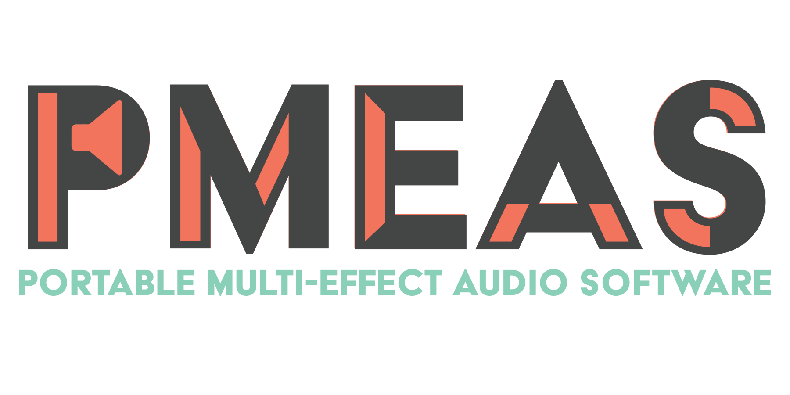

## Description
This is the **Android** mobile application designed to work with the [PMEAS backend application](https://github.com/pmeas/pmeas-backend "PMEAS Backend"). This application allows the user to perform multiple functionalities that are available in the official [frontend application](https://github.com/pmeas/pmeas-frontend "PMEAS frontend"). The application serves as a barebones model for how one could go about implementing (or extending from this project) a custom application to work with the backend application.

This is one component of several components that comprise the PMEAS system. Find the other components [here](https://github.com/pmeas "PMEAS Project"). 

## Supported Functionality
At present the following functionality is supported by the Android application:
* Adding and deleting all functional events
* Modifying all parameters for each effect.
* Changing the playback and capture ports for the backend to use.

## Installation
To directly download the application, simply navigate to this website from an Android mobile device and click [this link](app/app-release.apk "Link to APK") to download the device. Make sure you enabled the `Download from Unknown Sources` setting in the Settings Menu.

To compile the project yourself,
1. Download and Install [Android Studio](https://developer.android.com/studio/index.html "Android Studio Homepage").
2. Clone this repository to a local directory on your machine.
3. Open Android Studio and open the directory where you have cloned this repository.